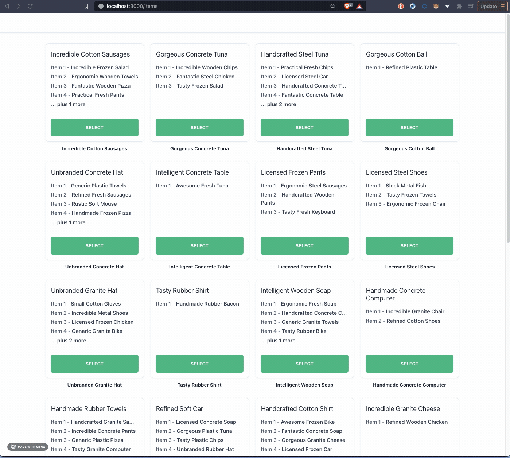

# Product Cards

This exercise is to show some JavaScript/TypeScript and the React framework in a real world setting. The goal was to create a mock-up of a generic marketplace page using an API.
I've create two pages: One page that shows a list of "Items", and a details page for a given Item.

## TOOLS:

- React
- TypeScript
- JavaScript
- Styled-Components
- React-Icons

##Demo

 [](assets/hoverView.gif)

 [](assets/itemPage.gif)

 [](assets/detailPage.gif)

 [](assets/navigation.gif)


### Api Structure

The structure of the Item object returned by the API is shown below:

```
{
    id: string,
    name: string,
    description: string,
    variants: [
      id: string,
      name: string,
      description: string,
      price: number,
    ],
    imageUrls: [
      {
        url: string,
      },
    ],
  };
```

### Setup

```
yarn install
```

### Run Application

```
yarn start
```

Running `yarn start` will start the application on port 3000 and the API on port 3001.

### API endpoints

There are only two end-points:

#### GET /items

Get the list of items available

```
http://localhost:3001/items
```

#### GET /items/:id

Get the details of a specific item by adding the id to the path.

```
http://localhost:3001/items/:id
```
